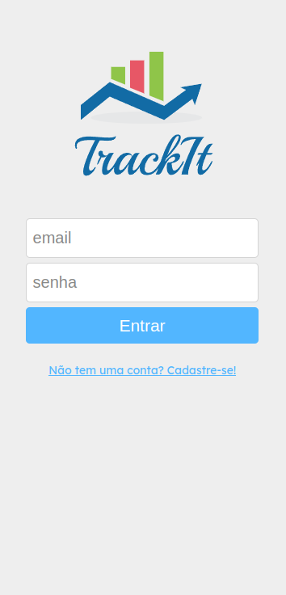
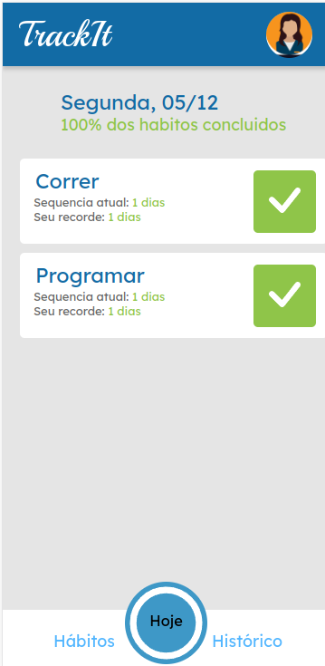
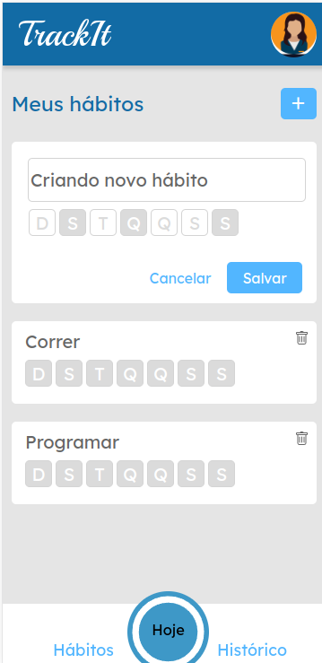

# Track-It

Esse é um projeto criada para o acompanhamento de seus hábitos! Com ele você cria o hábito e seleciona os dias da semana em que irá realiza-los. Você pode marcar os hábitos do dia e ver seu progresso!

Você pode testar esse projeto no seguinte link:
https://projeto10-trackit-l2by43p3t-mathchong.vercel.app/

## Prévia

<p align='center'>
</img>
</img>
</img>
</p>

## Como Rodar

Baixe o .zip do projeto e extraia na pasta desejada.

Instale as dependencias

```bash
npm install
```

Execute o projeto

```bash
npm run start
```

Prontinho, agora é só aproveitar e se organizar!